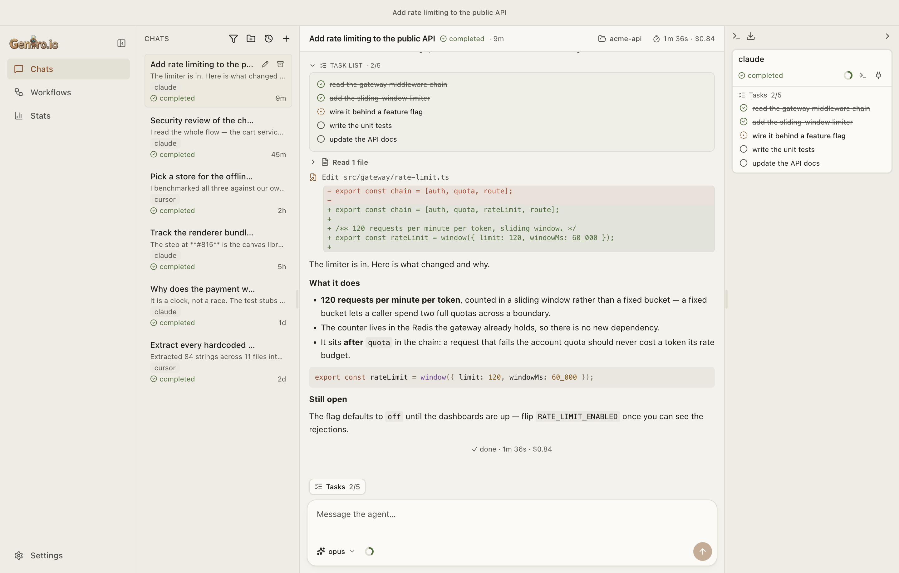
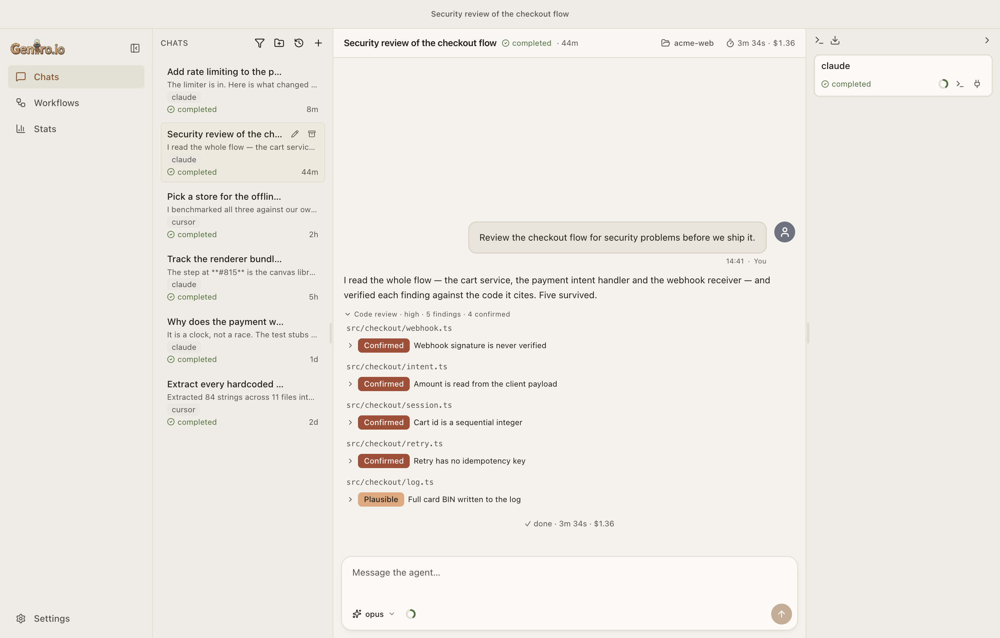
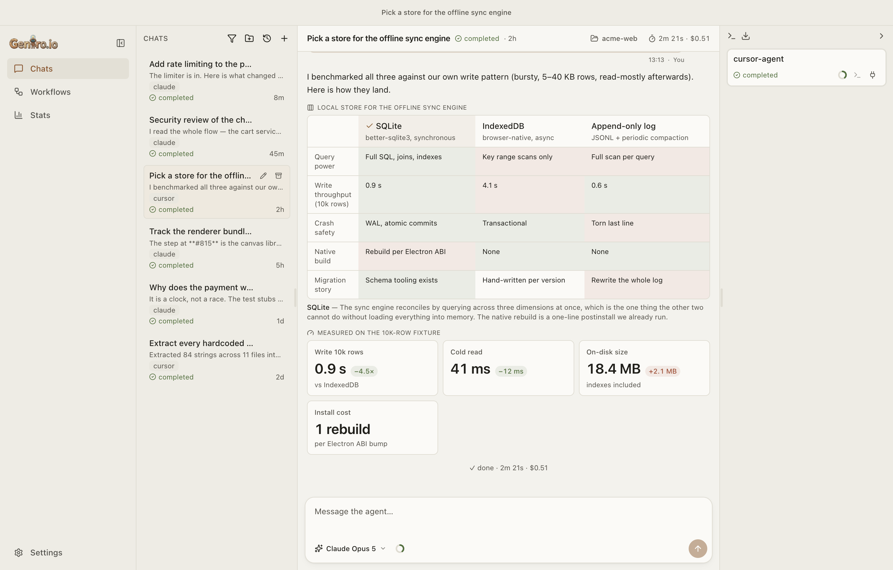
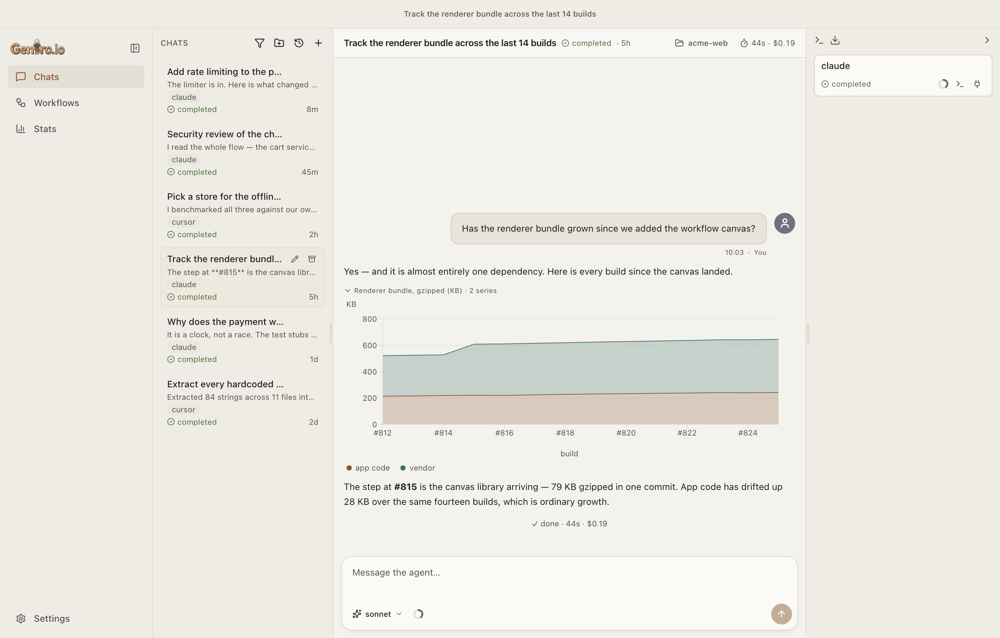
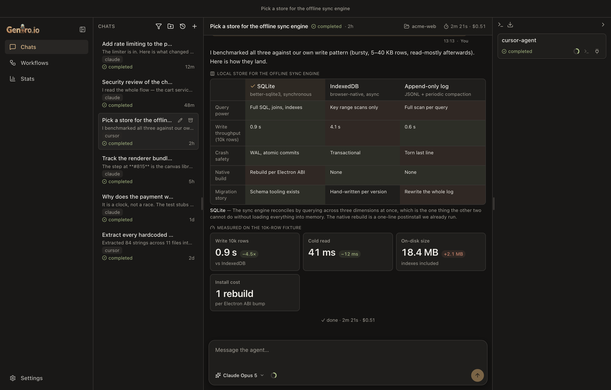
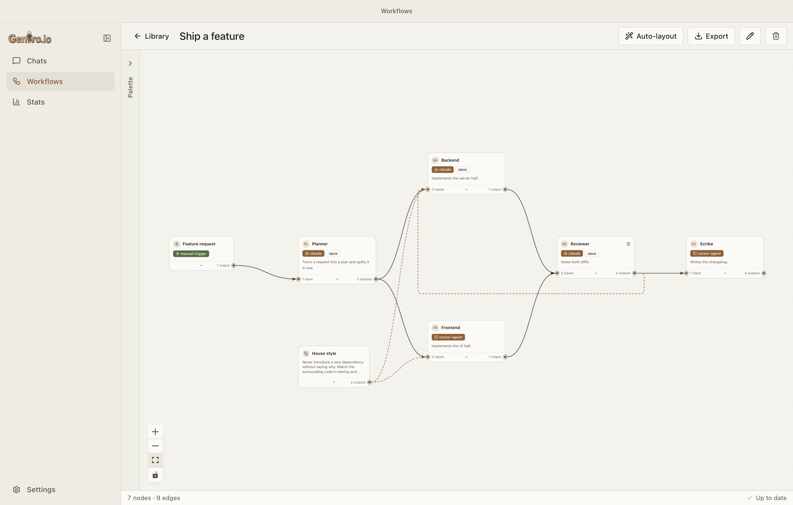
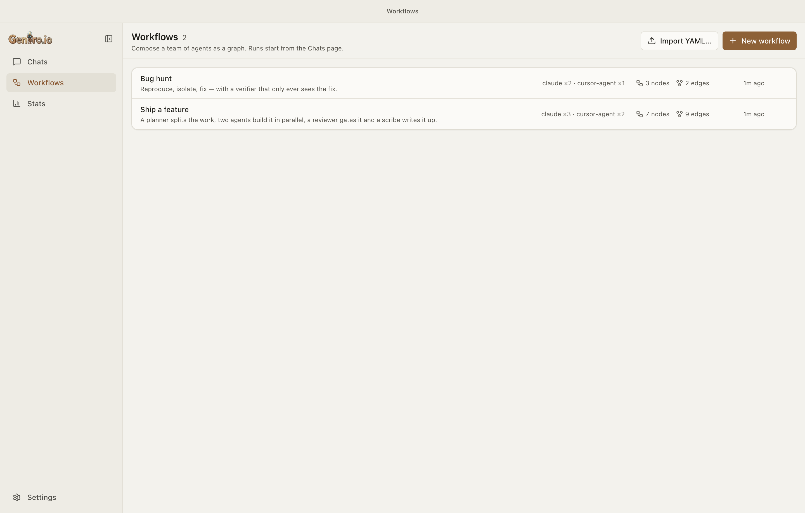
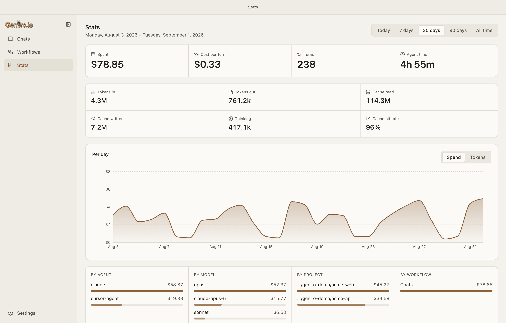
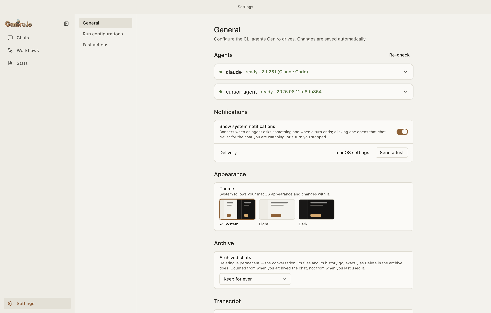

# Geniro

**A local-first macOS desktop app for running CLI coding agents — one at a time
in a chat, or as a whole team wired together as a graph.**

Geniro drives the coding CLIs you already have (`claude` and `cursor-agent`)
headlessly and gives them a real interface: a transcript that renders diffs,
charts, findings and plans; a canvas where several agents become a DAG; a
permission gate you actually see; and a ledger of what all of it cost.

**Everything runs on your machine.** There is no Geniro backend, no account, no
telemetry and nothing syncs anywhere. The agents authenticate with their own CLI
logins — Geniro stores no API keys of its own.



> The screenshots on this page use synthetic data — a fictional `acme-web` /
> `acme-api` project — so nothing here is anybody's real work.

---

## Contents

[What it does](#what-it-does) · [Chats](#chats--one-agent-at-a-time) ·
[Rich transcripts](#rich-transcripts--what-an-agent-can-draw) ·
[Workflows](#workflows--a-team-of-agents-as-a-graph) ·
[Agents that call agents](#agents-that-call-agents) ·
[Context and cost](#context-and-cost) ·
[Your CLIs, your accounts](#your-clis-your-accounts) ·
[Local-first](#local-first-and-private-by-construction) ·
[Install](#install-macos-apple-silicon) · [Develop](#develop) ·
[Architecture](#architecture) · [Releasing](#releasing) · [License](#license)

---

## What it does

|                            |                                                                                                                                                            |
| -------------------------- | ---------------------------------------------------------------------------------------------------------------------------------------------------------- |
| **Chat with one agent**    | Pick a folder, a CLI, a model, a reasoning effort, a context window and how much you want to be asked before it acts.                                      |
| **Compose a team**         | Wire agents into a DAG on a canvas — fan out, fan in, gate a step behind your approval, attach shared instruction blocks.                                  |
| **Let agents call agents** | A node can invoke another node mid-turn and wait for its answer, or fire it off and collect the result later.                                              |
| **See what they did**      | Diffs, plans, task lists, sub-agent blocks, background commands with their own terminal, findings, charts, scorecards, comparison tables, image galleries. |
| **Stay in control**        | Every tool call can be gated. Proposed patches and plans are answered on a card, with a note attached to your yes or no.                                   |
| **Know what it cost**      | An append-only usage ledger, broken down per day, agent, model, project and workflow — and it survives deleting the chat.                                  |
| **Hand it back**           | Reopen any conversation in your own terminal, in the same CLI, with one press.                                                                             |

---

## Chats — one agent at a time

A chat is one CLI agent working in one folder. The composer carries the choices
that actually change a run, and remembers them per CLI so the next chat opens on
the way you work:

- **Folder** and, beside it, an optional **agent config directory** — point a
  chat at a different profile, which in practice means a different account, a
  different subscription and a different toolbelt, without touching your default
  one. Name and colour those profiles once in Settings and pick them by name.
- **Model**, **reasoning effort**, **context window** and whatever else your CLI
  exposes for that particular model — the lists are asked of the CLI itself,
  never a table baked into this app, and cached across launches so switching
  agents is instant rather than a handshake.
- **Approval mode** — `auto`, `accept edits`, `ask`, or `plan`.
- **Run configurations**: save a whole setup (folder, branch, agent, model,
  effort, approval, config directory) under a name and start from it.
- **Fast actions**: your own named prompts, one press to drop into the message
  box, under whatever the composer is already set to.

**Sending mid-turn works.** A message written while the agent is busy is handed
to the running turn where the CLI supports it, and queued where it does not —
and the button says which before you press it.

**Organising**: group threads into coloured folders in the sidebar, rename them,
archive what is done (reversible), and delete from the archive when you mean it.
An optional retention window sweeps the archive on a clock; it is off until you
turn it on.

**Starting from a conversation you already had**: Geniro lists the sessions each
CLI holds on this machine and imports one — including a **content search**
across what was actually said, not just the titles, with the matching line
quoted.

---

## Rich transcripts — what an agent can draw

Every chat is handed Geniro's own MCP endpoint, so the agent can put a real
card in the transcript instead of spending its answer on ASCII art:

| Tool                | What lands in the transcript                                              |
| ------------------- | ------------------------------------------------------------------------- |
| `report_findings`   | A code-review report, grouped per file, with per-finding verdicts.        |
| `show_chart`        | A line / bar / area chart from typed numbers.                             |
| `show_metrics`      | A scorecard of headline figures with their changes.                       |
| `show_comparison`   | A decision table with per-cell verdicts and a named recommendation.       |
| `show_gallery`      | A set of images as a grid that opens into a zoomable viewer.              |
| `propose_patch`     | A diff the agent has **not** applied, with Apply and Reject.              |
| `propose_plan`      | How it means to proceed — approved or redirected before any work happens. |
| `ask_user_question` | An actual question card, for CLIs that have no way to ask you one.        |

<table>
<tr>
<td width="50%"></td>
<td width="50%"></td>
</tr>
<tr>
<td><b>Findings</b> — a review as a card, not as prose.</td>
<td><b>Comparison + scorecard</b> — the winning column reads green at a glance.</td>
</tr>
<tr>
<td width="50%"></td>
<td width="50%"></td>
</tr>
<tr>
<td><b>Charts</b> — measurements plotted, not tabulated.</td>
<td><b>Light, dark, or follow macOS</b> — the window chrome follows too.</td>
</tr>
</table>

Beside the cards, the transcript folds in everything the CLI itself reports: the
agent's **task list** as it ticks over, **sub-agent blocks** for each delegate it
launches, **backgrounded commands** with the live terminal output behind each
row, **thinking** streamed as it happens, markdown with local images, and pasted
screenshots delivered to the agent as real image content.

---

## Workflows — a team of agents as a graph

A workflow is a DAG you draw on a canvas. Its source of truth is a plain
`*.geniro.yaml` file, so it can be exported, reviewed in a pull request, and
imported somewhere else.



- **Three node kinds** — a _trigger_ that fires the run, _agents_ that do the
  work, and _instruction blocks_ whose text is appended to the turns of every
  agent they are wired to (write the house style once, attach it to three
  agents).
- **Three edge kinds** — `data` (the producer's answer feeds the consumer's
  prompt, and orders the DAG), `call` (grants the source permission to invoke
  the target at runtime), and `instruction`.
- **Per-node settings**: its own agent, model, effort, approval mode, config
  directory and a private `role` — plus a public one-line `description`, which
  is the only thing other agents are ever told about it.
- Producers with no dependency on each other **run in parallel**; each node's
  progress, transcript and cost is inspectable while the run is going.



---

## Agents that call agents

A node with outgoing `call` edges is handed three tools on a loopback MCP
endpoint scoped to that node alone:

- **`call_agent`** — invoke a callee. Synchronously (wait for its answer),
  asynchronously (carry on and collect later), or fire-and-forget.
- **`await_agent`** — collect what an async call produced.
- **`answer_agent`** — answer a _question the callee asked back_. A callee that
  needs a decision does not stall: the question travels to its caller, which
  either answers it or escalates it to you on a card.

Depth and turn budgets bound the whole thing, every call token is per-node and
revoked at teardown, and the exchange is recorded in the caller's own
transcript.

---

## Context and cost

**Per chat**: a context meter in the composer, and a panel that breaks the
window down by what is actually filling it — which MCP server is holding
100k tokens is the kind of thing that is invisible until it is summed. Beside
it, what the thread has spent.

**Across everything**: a Stats page over an append-only usage ledger. It is
deliberately not computed from transcripts, so deleting a chat does not shrink
your lifetime total.



Figures a CLI does not report stay blank rather than rendering as `$0` —
"not measured" and "free" are different answers.

---

## Your CLIs, your accounts

- **claude** — driven as `claude -p` over its stream-json protocol, with the
  process kept alive between turns so your MCP servers boot once per
  conversation instead of once per message.
- **cursor-agent** — driven over its first-party **ACP** server
  (`cursor-agent acp`).

Both are headless: no SDKs, no LangGraph, no Python, and no API key of Geniro's
own — they use the login you already made in your terminal.

- **Sign in and out from inside the app**, including the verification-code step.
- **MCP servers** are listed per folder with the health the CLI reported, their
  config scope, and a switch — and the switch writes the CLI's **own** config,
  so a server you turn off in Geniro is off in your terminal too, and the
  reverse.
- **Skills and slash commands** feed the composer's `/` autocomplete, merged
  from your project, your home directory and the CLI's own reported list.
- **Handoff**: reopen any chat, workflow node or call thread in your own
  terminal, with the right model, profile and session id — or copy the
  invocation as one line.



---

## Local-first, and private by construction

- **No Geniro cloud.** No backend, no account, no telemetry, nothing syncs
  between machines. The only outbound calls are your own `gh` CLI against your
  own repositories, an optional read of your own Cursor usage figure, and
  Geniro's public release feed when you ask it to check for updates.
- **The daemon binds `127.0.0.1` only** and gates every non-public route with a
  bearer token minted fresh at each launch.
- **No secrets are stored.** Both CLIs carry their own login; the Keychain-only
  rule stands as policy with nothing currently in it. Child processes are
  spawned with every `GENIRO_`-prefixed variable and every named credential
  stripped, and only what that particular child is entitled to re-injected — so
  no agent inherits another agent's credential.
- **Workflows are YAML on disk**; SQLite holds runtime and history only.
- **A debug log you can read**, scrubbed of registered secrets on the way in,
  plus a one-paste diagnostics report for bug reports.
- **Updates are announced, never silent** — you update with `brew upgrade` or by
  re-running the install script.

---

## Install (macOS, Apple Silicon)

Builds are signed with Geniro's own certificate but are **not notarized** (no
Apple Developer ID). Both install paths therefore strip the macOS quarantine
flag so Gatekeeper doesn't block the app — the Homebrew cask does it in a
`postflight`, the install script via `xattr`. (A DMG opened straight from a
browser download **would** be blocked — use brew or the script.)

The certificate is there so macOS can tell one release from the next: every
privacy permission you grant is recorded against the app's code signature, and
before the app was signed each new build looked like a different app and asked
for all of them again.

**Homebrew (recommended):**

```sh
brew tap geniro-io/tap
brew trust geniro-io/tap       # third-party taps need an explicit trust (Homebrew 6+)
brew install --cask geniro     # not notarized; the cask strips the quarantine bit post-install
brew upgrade --cask geniro     # later, to update
```

**Install script:**

```sh
curl -fsSL https://raw.githubusercontent.com/geniro-io/geniro-app/main/scripts/install.sh -o /tmp/geniro-install.sh
bash /tmp/geniro-install.sh                    # re-run to update
```

Geniro **notifies** you when a newer release exists (Settings → Check now) but
does not silently self-update.

### Requirements

macOS · at least one agent CLI installed and signed in (`claude` and/or
`cursor-agent`) — they are detected on first run.

To build from source you also need Node ≥ 24, pnpm 11 (via `corepack`) and Xcode
Command Line Tools (for the native `better-sqlite3` build).

---

## Develop

```bash
pnpm install          # install workspace deps
pnpm rebuild:native   # rebuild better-sqlite3 against Electron's ABI (required)
pnpm build            # build all packages + the UI (turbo → swc / electron-vite)
pnpm dev              # launch the Electron app — spawns and supervises the daemon

pnpm daemon:dev       # daemon-only watch loop (TS source, restarts on save)
pnpm storybook        # the component catalog (dev only; never packaged)

pnpm full-check       # build + check-types + lint + unit tests — run before finishing
pnpm generate:api     # regenerate the renderer's daemon client from the daemon's OpenAPI
```

`pnpm rebuild:native` is required because the daemon runs under Electron's
bundled Node, so its native `better-sqlite3` must be built for Electron's ABI
(not the host Node ABI).

`CLAUDE.md` at the repo root, plus `apps/ui/CLAUDE.md` and
`apps/daemon/CLAUDE.md`, are the working documentation — they carry the reasons
behind the design, not just its shape.

---

## Architecture

A pnpm + Turbo monorepo. The Electron app supervises a bundled local daemon over
loopback; the daemon is where every agent actually runs.

```
apps/
  ui/               @geniro/ui       — Electron main + preload + React 19 renderer (electron-vite)
  daemon/           @geniro/daemon   — NestJS loopback daemon over @packages/http-server + MikroORM/SQLite
packages/
  common/           @packages/common — app bootstrapper, pino logger, exceptions
  http-server/      @packages/http-server — NestJS + Fastify host: health, swagger, helmet, validation
  metrics/          @packages/metrics — Prometheus metrics
  mikroorm/         @packages/mikroorm — base entity/DAO + MikroORM module (SQLite driver)
```

**The daemon is a separable engine.** The UI spawns the built daemon as a child
process (`ELECTRON_RUN_AS_NODE`), waits for its health probe, then loads the
renderer. The daemon writes a pidfile (pid, host, port, per-launch bearer token)
only once it is healthy and listening, and the UI discovers the bound host and
port by reading it — nothing assumes a port. A relaunching UI reuses a
still-running daemon and sweeps orphaned pidfiles.

**Storage split**: workflow definitions → YAML under the userData dir; settings
→ `settings.json`; pasted images → files; secrets → none; SQLite holds runtime
and history only (`runs`, `items`, `node_state`, `run_groups`, and the
append-only `usage_events` ledger).

**The renderer's daemon client is generated**, never hand-mirrored: the daemon's
zod schemas become its OpenAPI document, and `pnpm generate:api` emits the typed
client into `apps/ui/src/renderer/autogenerated/` (committed).

**Build toolchain**: swc compiles the daemon and all `packages/*` to CommonJS;
electron-vite builds the UI. Internal `@packages/*` imports resolve to TypeScript
source via a tsconfig path alias, so type-checking runs as a separate
`tsc --noEmit` (`pnpm check-types`).

**Vendored from the sibling [Geniro](https://github.com/geniro-io) monorepo**:
`packages/{common,http-server,metrics,mikroorm}`, adapted for local-first use —
SQLite instead of Postgres, no Sentry, no Redis, no cloud, loopback-only bind.
Changes are kept minimal so fixes can flow between the repos.

---

## Releasing

Pushing to `main` runs `.github/workflows/release.yaml`: `semantic-release`
determines the version and tags `v<x.y.z>`, a GitHub Release is cut, then the
`build-app` job (macOS runner) syncs `apps/ui` to the tag, imports the release
signing certificate from the `GENIRO_SIGNING_P12` /
`GENIRO_SIGNING_P12_PASSWORD` repository secrets (generate them once with
`node scripts/make-signing-identity.mjs`), runs `build:mac`, and attaches
`Geniro-<v>-arm64.dmg` + `-arm64-mac.zip`. Without those secrets the job fails
rather than shipping an unsigned build, which would silently reset every user's
macOS permissions.

**Homebrew tap auto-bump** (optional): the tap repo `geniro-io/homebrew-tap`
holds the cask ([`packaging/homebrew/geniro.rb`](packaging/homebrew/geniro.rb) is
its seed). To have each release rewrite the cask's version + sha256
automatically, set the repo **variable** `HOMEBREW_TAP_REPO=geniro-io/homebrew-tap`
and the **secret** `HOMEBREW_TAP_TOKEN` (a PAT with write access to the tap); the
`bump-cask` job stays skipped until both are set (bump the cask by hand meanwhile).

---

## License

[Apache License 2.0](LICENSE) — see also [`NOTICE`](NOTICE) for attribution.
