# Geniro

A local-first macOS app for **Claude Code, Cursor Agent and Codex**. Chat with
one coding agent, connect a team in a visual workflow, or run tasks from a board.
Geniro uses your agents' own CLI logins and needs no Geniro account.

## Install

**macOS · Apple Silicon**

With Homebrew:

```sh
brew tap geniro-io/tap
brew trust geniro-io/tap # required for third-party taps on Homebrew 6+
brew install --cask geniro
```

Or download and run the install script:

```sh
curl -fsSL https://raw.githubusercontent.com/geniro-io/geniro-app/main/scripts/install.sh -o /tmp/geniro-install.sh
bash /tmp/geniro-install.sh
```

The app is signed but not notarized. Both methods handle macOS quarantine;
use one of them to install. Updates install from inside the app. If an update
cannot replace your copy, run `brew upgrade --cask geniro` or the script again.

**First run:** open Geniro, install or select an agent CLI, sign in, and choose
your project folder. Missing CLIs can be installed from onboarding or Settings.

[Features](#features) · [Agent pools](#workflows-and-agent-pools) ·
[Local models](#local-models) · [Screenshots](#screenshots) ·
[Development](#development)

## Features

- **Chats:** choose a model, profile and approval mode. Save run configurations
  and reusable prompts, import CLI sessions, search conversations, and export
  threads to Markdown.
- **Agent teams:** connect agents on a canvas, run independent steps in parallel,
  and let agents call, message and ask questions of each other.
- **Agent pools:** give a workflow agent several accounts, models or CLIs to
  distribute calls and continue when one hits a usage limit.
- **Task board:** each card gets its own git worktree, branch and chat or workflow.
  Agents write reports and attach pull requests; autopilot works through the queue.
- **Rich results:** see diffs, review findings, charts, comparisons, image galleries
  and interactive pages alongside tool calls, sub-agents and background commands.
- **Accounts and tools:** manage named profiles, install and update CLIs, sign in,
  add or toggle MCP servers, and use skills and slash commands from the composer.
- **Context and stats:** inspect context usage and plan limits, set auto-compaction,
  and track cost, tokens, time, pull requests and changed lines. The usage ledger
  survives deleted chats; unavailable measurements stay blank.
- **Phone and terminal:** follow or steer live sessions from a paired phone, or
  reopen a conversation in your own terminal with its model, profile and session.
- **Local models:** use tool-capable Ollama models with Claude Code or Codex.

## Workflows and agent pools

Connect agents and shared instruction blocks on the canvas. Dependencies set
which steps run first; independent agents run in parallel. Workflows are saved as
`*.geniro.yaml` files you can export, review and reuse.

In an agent node's settings, add an **Agent pool** to give it several
configurations. Each member can have its own CLI, account profile, model,
approval mode and MCP settings. For example, a reviewer can use two Claude
accounts and a Codex configuration.

New calls rotate through members. Those that recently hit a limit or need
sign-in are tried last.
If a member hits a usage limit or its sign-in expires, Geniro tries the next one.
Continuing a call keeps it on the member that handled it. Pools apply to
**calls between agents**; ordinary workflow steps and direct messages use the
node's main configuration.

## Local models

Start Ollama on your Mac and download a model that supports tool calling.
Choose it under **Ollama · local models** in the Claude Code or Codex model picker.
Geniro discovers local models automatically and explains when a model or CLI
cannot be used. Local inference runs on your machine and can work offline.

## Your phone

In **Settings → Remote access**, scan the QR code and enter the pairing code
shown on your Mac. Your phone opens the same live chats, workflows and board
on your Wi-Fi. For access away from home, **Get an address** can start an
installed `cloudflared` or `ngrok` tunnel from the Mac.

## Local-first

Geniro has no cloud backend, account or telemetry. Chats, workflows and task
history live on your Mac; agents keep their own logins and connect to their
model providers. Ollama offers local inference.

The daemon listens on loopback with a per-launch credential. Remote access
uses a separate gateway and requires device pairing. Agent-built pages run
in a sandbox; they can display local pictures and load libraries from allowed
CDNs. Public metadata fetches support app updates and model pricing; CLI
installation, optional Cursor usage lookup and tunnels also use the network.

## Screenshots

<details>
<summary>View screenshots: chats, workflows, task board, stats and phone</summary>

All screenshots use synthetic data from a fictional `acme-web` / `acme-api`
project.

### Chats

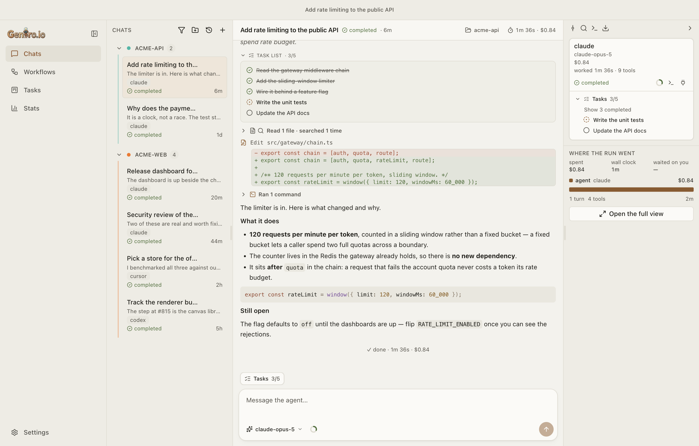

<table>
<tr>
<td width="50%">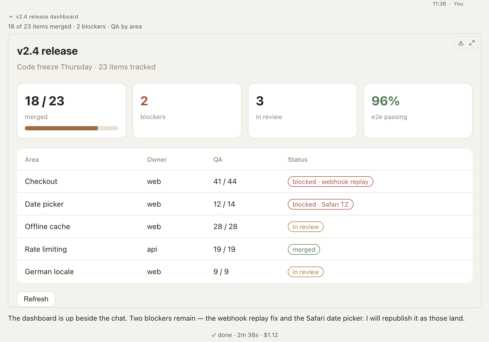</td>
<td width="50%">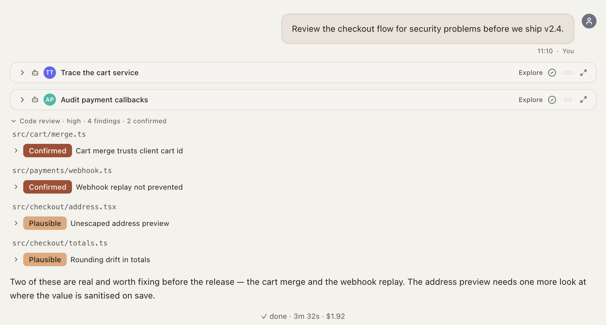</td>
</tr>
<tr>
<td><b>Artifacts</b>: a page the agent built, running in a sandbox next to the chat.</td>
<td><b>Findings</b>: a review as a card instead of prose, with the sub-agents that did the tracing.</td>
</tr>
<tr>
<td width="50%">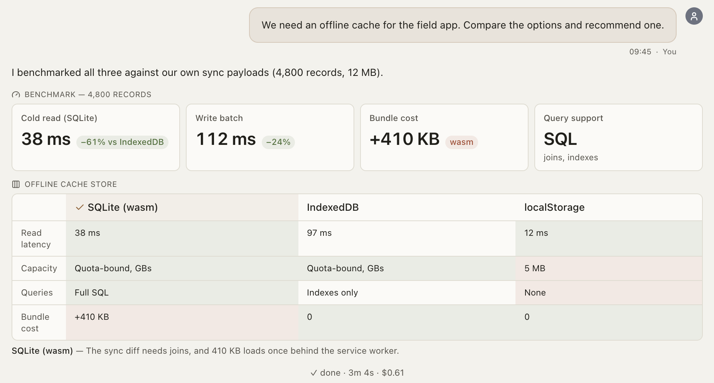</td>
<td width="50%">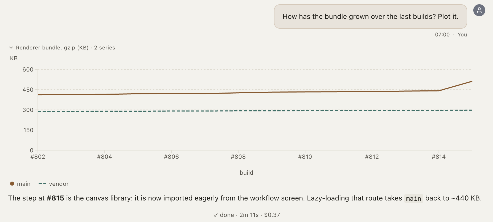</td>
</tr>
<tr>
<td><b>Scorecard + comparison</b>: the winning column stands out at a glance.</td>
<td><b>Charts</b>: measurements plotted instead of listed in a table.</td>
</tr>
</table>

### Workflows

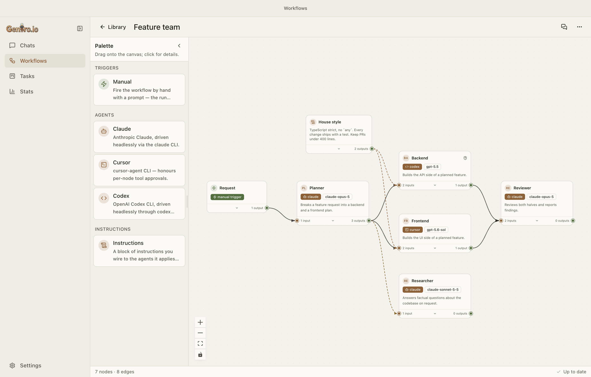

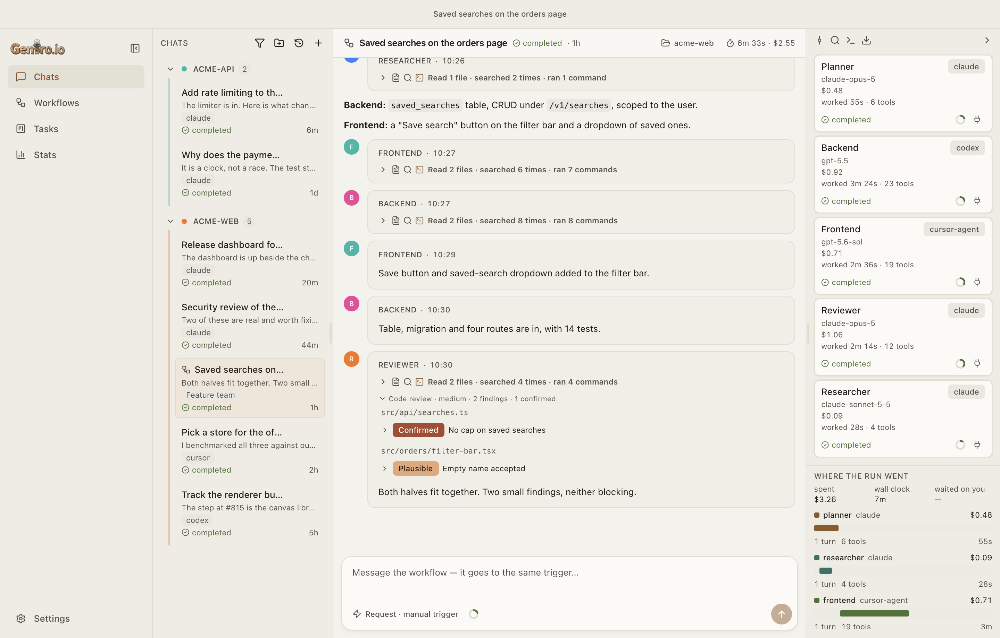

### Task board

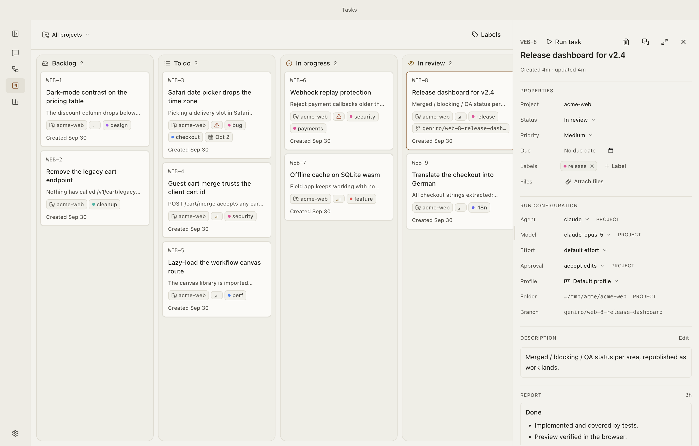

### Context and stats

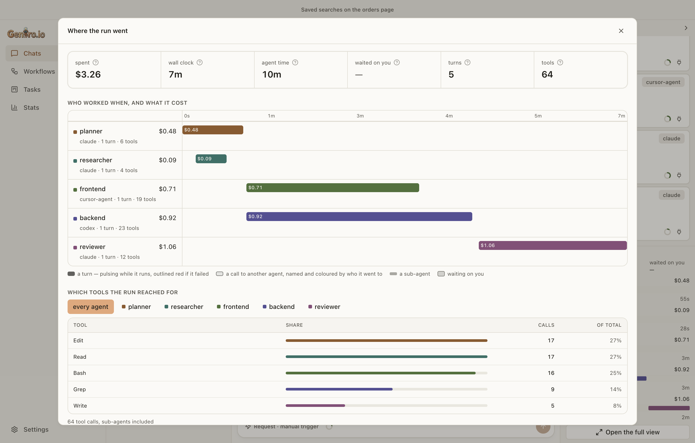

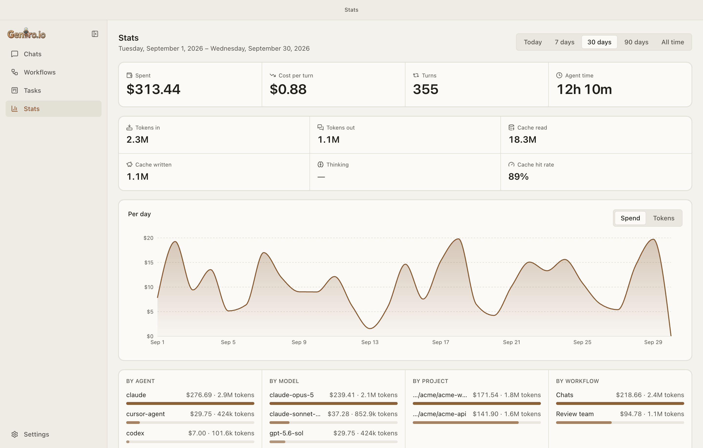

### Phone and remote access

<table>
<tr>
<td width="33%">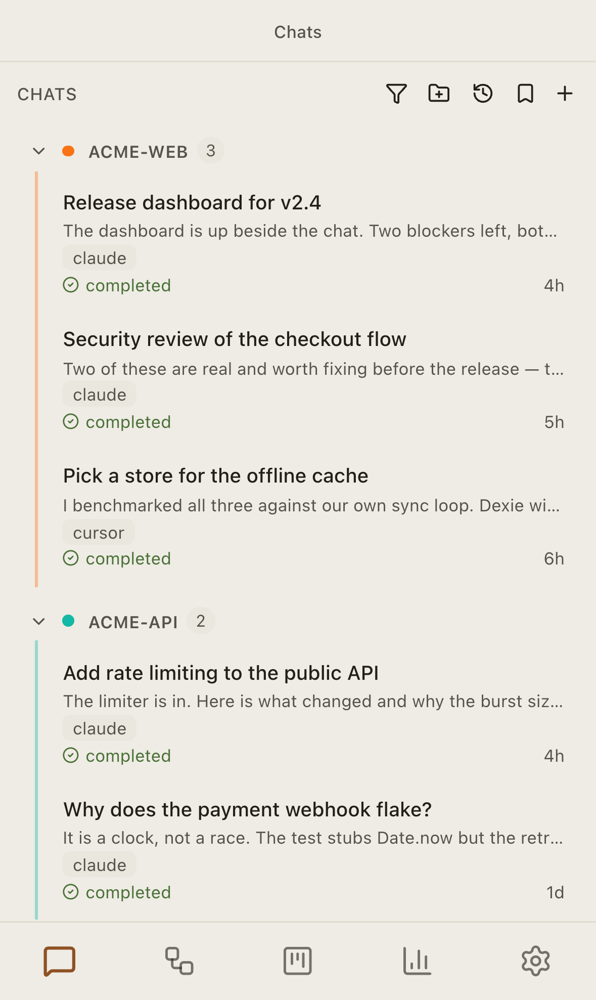</td>
<td width="33%">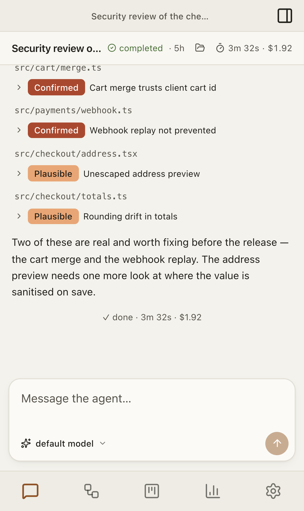</td>
<td width="34%">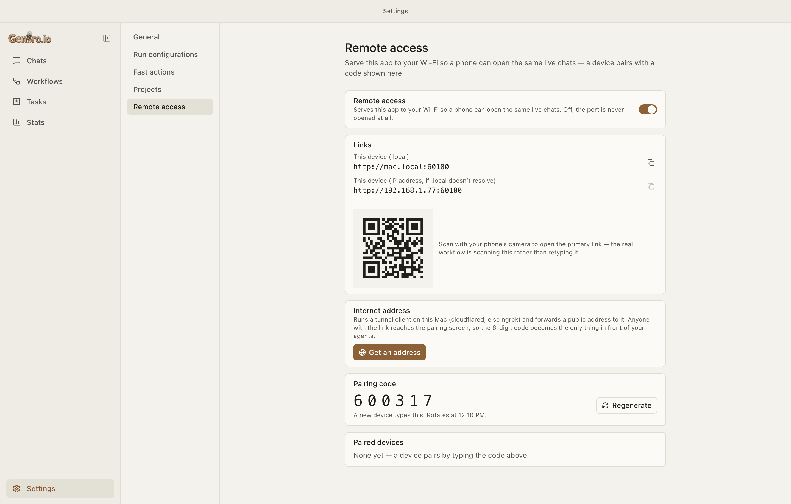</td>
</tr>
</table>

### Settings and dark theme

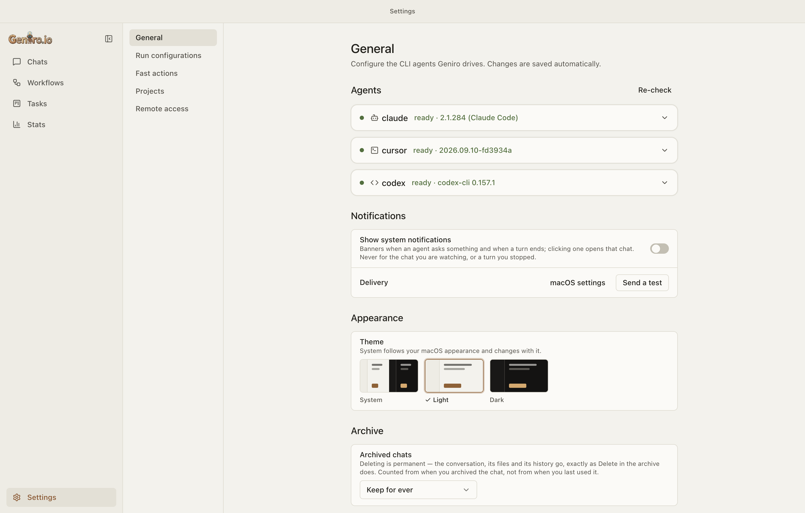

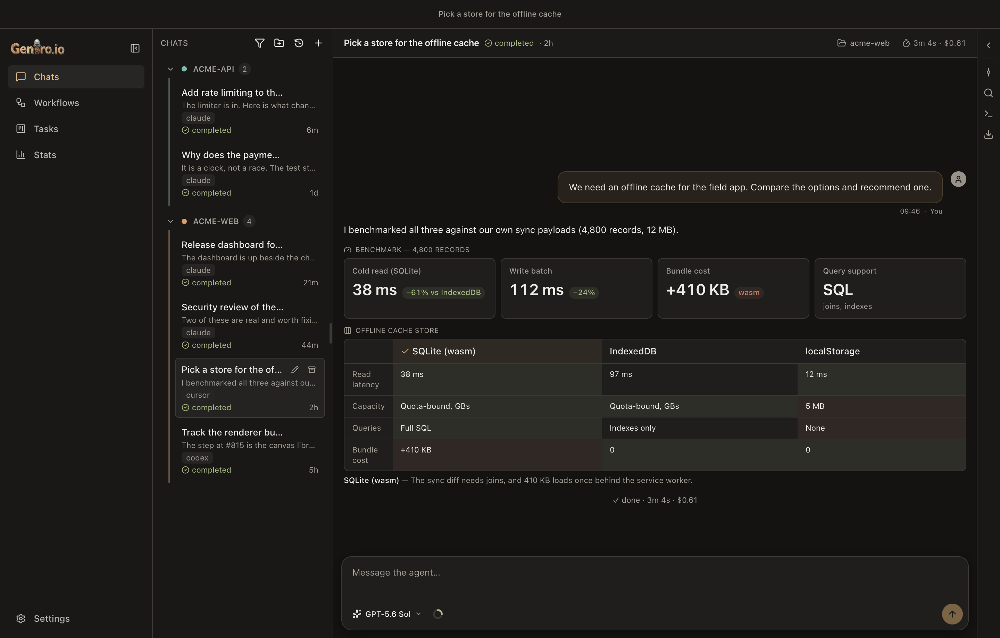

</details>

## Development

See the [development guide](docs/development.md) for source setup, commands,
architecture and releases. It includes the required native rebuild and
`pnpm full-check` verification.

## License

[Apache License 2.0](LICENSE). See also [NOTICE](NOTICE) for attribution.
